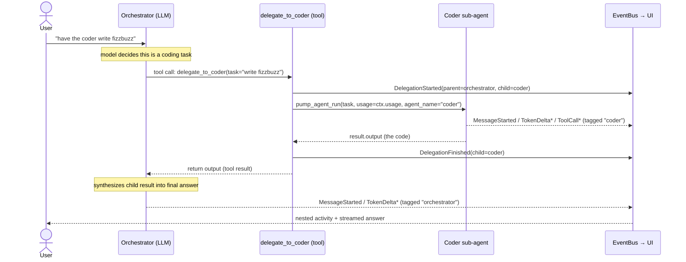

# aidbg

A Textual TUI multi-agent CLI built on **pydantic-ai**. An orchestrator agent
delegates to specialist sub-agents (coder / researcher / code-reviewer) via tool
calls, streaming tokens, thinking, tool activity, and delegations to a chat UI
with a live activity sidebar.

Capabilities wired end-to-end: **function calling**, **streaming**, **MCP client**,
and **multi-agent delegation** with aggregated token usage.

## Quick start

```bash
uv sync                       # install
cp .env.example .env          # then edit: set a backend base_url/api_key/model
uv run aidbg                  # launch the TUI
```

Any OpenAI-compatible backend works (DeepSeek, Ollama, vLLM, OpenAI). For a fully
local run, point the `default` profile at Ollama:

```
AIDBG_DEFAULT__BASE_URL=http://localhost:11434/v1
AIDBG_DEFAULT__API_KEY=ollama
AIDBG_DEFAULT__MODEL=qwen2.5:14b
```

### In the TUI

- Type a message and press **Enter**. The orchestrator replies, streaming Markdown.
- Ask it to *"have the coder write fizzbuzz"* → the sidebar shows the delegation,
  the coder's tokens stream into a second bubble badged `coder`, then it returns.
- Ask it to *"read pyproject.toml"* → the `read_file` tool fires; the sidebar logs
  the call and result.
- **Ctrl+S** saves the transcript; start with `--resume` to restore it.
- **Ctrl+C** quits.

### CLI

```bash
uv run aidbg --list-agents        # print registered agents (no TUI)
uv run aidbg --workspace ./proj   # set workspace root for file tools
uv run aidbg --resume             # load saved history at startup
```

## Architecture

A one-directional four-layer stack; only `ui/` imports Textual:

```
ui       → subscribes to the EventBus, calls session.run()
session  → ChatSession: history + event bus + run loop
core     → pydantic-ai wiring, registries, streaming event pump
config   → pydantic-settings profiles + mcp_servers.json
```

The **streaming pump** (`core/streaming.py`) is the single bridge: it iterates a
pydantic-ai run and translates each event into a flat `UiEvent` published on a
fan-out `EventBus`. Sub-agents run through the *same* pump tagged with their name,
so nested activity renders naturally. See `PLAN.md` for the full design.

## How sub-agent delegation works

**When** a sub-agent is called is decided by the orchestrator *model*, not by
code. Each sub-agent is exposed to the orchestrator as an ordinary tool named
`delegate_to_<name>`, whose description comes from the sub-agent's
`AgentSpec.description`. The model reads those descriptions plus its own
instructions (`prompts/orchestrator.md`) and picks a tool — delegating is just a
function call, no different from calling `read_file`. So the two levers for
"when to delegate to whom" are the orchestrator prompt (policy) and each
sub-agent's `description` (the selection cue).

**How** it runs: `build_orchestrator` walks the orchestrator's `delegates_to` and
attaches one `delegate_to_<child>` tool per sub-agent (`_make_delegate_tool` in
`core/agent_factory.py`). When the model calls one, the adapter runs the child
through the *same* `pump_agent_run`, tagged with the child's name, forwarding
`ctx.usage` so the child's tokens aggregate into the parent run.



Key invariants: the child only sees the `task` string (not the full history — so
tasks must be self-contained), and `usage=ctx.usage` is forwarded so token
accounting aggregates across agents.

## Extending

Everything extends via explicit, greppable drop-ins (no plugin magic):

- **Add a tool** — write `src/aidbg/tools/<name>.py` with `@TOOLS.register()`,
  then import it in `tools/__init__.py`. Reference it from an agent's `tool_names`.
- **Add a sub-agent** — write `src/aidbg/agents/<name>.py` registering an
  `AgentSpec`, import it in `agents/__init__.py` (children *before* the
  orchestrator), and add its name to the orchestrator's `delegates_to`. The
  `code-reviewer` agent is a worked example of exactly this: `agents/code_reviewer.py`
  + `prompts/code_reviewer.md` + one entry in `delegates_to` gave the orchestrator
  a `delegate_to_code_reviewer` tool with no other wiring. Optionally add a
  `profile_<name>` field in `config/settings.py` to route it to a different backend.
- **Add an MCP server** — add one entry to `mcp_servers.json`, then list its name
  in an agent's `mcp_names`.

## Development

```bash
uv run pytest                 # no backend needed (TestModel/FunctionModel)
uv run ruff check src tests
uv run mypy src

# layering invariant: core/session/config must not import textual
! grep -RIE 'import textual|from textual' src/aidbg/core src/aidbg/session src/aidbg/config
```
