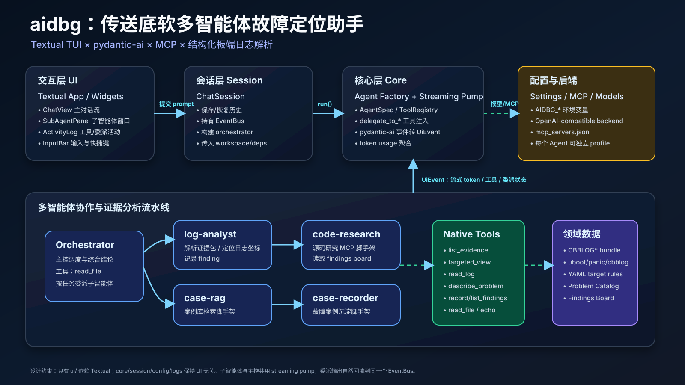
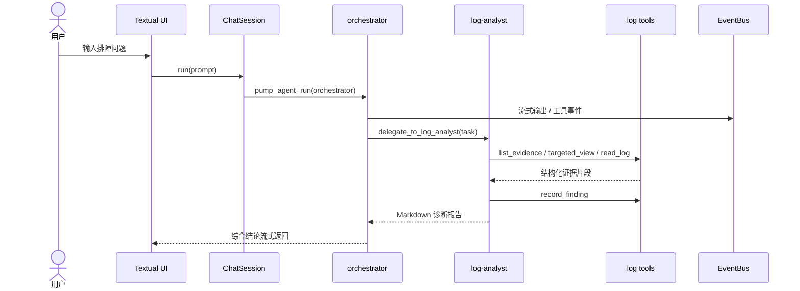

# aidbg：传送底软多智能体故障定位助手

`aidbg` 是一个面向 **传送底软 / embedded-Linux BSP** 故障定位场景的命令行 TUI 工具。项目基于 **Textual** 构建聊天式终端界面，基于 **pydantic-ai** 组织主控智能体与多个专业子智能体，并通过原生工具、MCP 工具集、结构化日志解析与共享 findings board 来完成板端日志证据分析、故障假设沉淀和后续源码/案例库联动。



## 项目定位

这个项目不是一个通用聊天机器人，而是一个“多智能体协同定位助手”框架，当前聚焦以下工作流：

1. 用户在 TUI 中提出排障问题，例如：`triage samples/fake_evidence — why does the board keep rebooting?`。
2. `orchestrator` 主控智能体根据提示词与子智能体描述选择是否委派任务。
3. `log-analyst` 使用结构化日志工具读取 `CBBLOG*` / `CBBLOGDUMP*` 证据包，输出带稳定坐标的诊断报告。
4. `case-rag`、`code-research`、`case-recorder` 读取共享 findings board，并在后续接入真实 RAG、源码检索 MCP、案例库后补全闭环能力。
5. UI 通过统一事件总线实时展示 token 流、工具调用、子智能体委派状态和最终综合结论。

## 核心能力概览

- **多智能体编排**：`orchestrator` 通过自动注入的 `delegate_to_<agent>` 工具委派给 `log-analyst`、`case-rag`、`code-research`、`case-recorder`。
- **流式输出**：`core/streaming.py` 将 pydantic-ai 的模型事件、工具事件统一转换为 UI 可消费的 `UiEvent`。
- **结构化日志分析**：`logs/` 领域层将证据包解析为 `Evidence → Bundle → LogFile → LogRecord`，工具层提供 `list_evidence`、`targeted_view`、`read_log`、`describe_problem`。
- **共享 findings board**：`record_finding` 与 `list_findings` 是子智能体之间交换线索的轻量数据通道。
- **OpenAI-compatible 后端**：支持 DeepSeek、Ollama、vLLM、OpenAI 等兼容接口；不同智能体可以配置不同模型 profile。
- **MCP 扩展位**：`mcp_servers.json` 与 `AgentSpec.mcp_names` 已经预留，后续可接入代码搜索、知识图谱、案例库等服务。
- **可测试的分层设计**：除 UI 层外，`core/session/config/logs` 不依赖 Textual，便于单元测试和复用。

## 快速开始

```bash
uv sync
cp .env.example .env  # 如果仓库中没有该文件，可直接创建 .env
uv run aidbg
```

示例 `.env`（本地 Ollama）：

```dotenv
AIDBG_DEFAULT__BASE_URL=http://localhost:11434/v1
AIDBG_DEFAULT__API_KEY=ollama
AIDBG_DEFAULT__MODEL=qwen2.5:14b
```

常用命令：

```bash
uv run aidbg --list-agents        # 查看已注册智能体
uv run aidbg --workspace ./proj   # 设置文件工具与证据读取的工作区根目录
uv run aidbg --resume             # 启动时恢复保存过的对话历史
uv run pytest                     # 运行测试，不需要真实 LLM 后端
uv run ruff check src tests       # 静态风格检查
uv run mypy src                   # 类型检查
```

TUI 快捷键：

- **Enter**：提交输入。
- **Ctrl+S**：保存对话历史。
- **F1**：查看帮助。
- **Ctrl+C**：退出。

## 目录结构

```text
.
├── configs/                 # 日志目标规则与问题目录
│   ├── logs/                # uboot / panic / cbblog 的 YAML 匹配规则
│   └── problems.yaml        # 问题签名、可能原因、验证步骤
├── docs/
│   └── architecture-ppt.svg # README 引用的架构 PPT 图片
├── prompts/                 # 各智能体系统提示词
├── samples/fake_evidence/   # 可用于测试的模拟证据包
├── scripts/                 # 生成假日志、运行 live triage 的脚本
├── src/aidbg/
│   ├── agents/              # AgentSpec 注册入口，一文件一个智能体
│   ├── config/              # pydantic-settings 与 MCP 配置加载
│   ├── core/                # pydantic-ai 封装、注册表、事件泵、模型工厂
│   ├── logs/                # 日志领域模型与解析器
│   ├── session/             # 会话、历史与 run loop
│   ├── tools/               # 原生工具注册入口
│   └── ui/                  # Textual TUI，唯一依赖 textual 的层
├── tests/                   # 单元测试与 UI headless 测试
├── mcp_servers.json         # MCP 服务列表
├── pyproject.toml           # 项目元数据、依赖与命令入口
└── uv.lock
```

## 架构详解

项目采用单向依赖的四层结构：

```text
ui       → 订阅 EventBus，调用 ChatSession.run()
session  → 管理历史、EventBus、workspace 与单轮运行
core     → pydantic-ai Agent 构建、工具/智能体注册、streaming pump
config   → 环境变量、模型 profile、MCP 配置
logs     → 板端日志领域模型，供 tools 调用
```

关键约束：**只有 `src/aidbg/ui/` 可以导入 Textual**。这使得核心运行链路、日志解析、配置、工具与智能体注册都可以在无 UI 环境中测试。

### 1. UI 层

UI 层由 `AidbgApp` 组织：主聊天区展示用户与主控回答，子智能体窗口展示 `log-analyst` 等子任务输出，侧边栏展示工具调用和委派活动。UI 不直接理解 pydantic-ai 的事件，而是只消费 `core.events.UiEvent`。

主要组件：

- `ui/app.py`：Textual 应用壳、布局、快捷键、事件分发。
- `ui/workers.py`：后台运行单轮对话，订阅事件总线并 post 到 Textual 消息系统。
- `ui/widgets/`：聊天消息、输入框、活动日志、智能体列表、子智能体面板。
- `ui/app.tcss`：界面样式。

### 2. Session 层

`ChatSession` 是一次对话的核心上下文：

- 保存 `history`，并在每轮完成后用 `result.all_messages()` 更新上下文。
- 持有 `EventBus`，供 streaming pump 发布事件。
- 构造 `AppDeps`，注入 workspace、settings、findings board 等共享依赖。
- 负责进入 agent async context，以便 MCP toolset 正确打开和关闭连接。

### 3. Core 层

Core 层是项目最重要的抽象层：

- `registry.py`：定义 `AgentSpec`、`AGENTS`、`TOOLS`。新增智能体或工具时只需要注册并在 `__init__.py` 导入。
- `agent_factory.py`：从 `AgentSpec` 构建 pydantic-ai `Agent`；对主控智能体额外注入 `delegate_to_<child>` 工具。
- `streaming.py`：唯一的 pydantic-ai → UI 事件桥，将模型文本、thinking、工具调用、工具结果、run 结束或错误转换为 `UiEvent`。
- `models.py`：基于 OpenAI-compatible profile 构造模型。
- `mcp.py`：根据 `mcp_servers.json` 和 agent 声明构造 MCP toolsets。
- `deps.py`：定义工具与智能体运行时共享依赖。

### 4. Logs 领域层

`logs/` 不做最终诊断，只负责“可信地加载与表达证据”：

- `bundle.py`：识别 `CBBLOG0..11`、`CBBLOGDUMP0..2` 等证据包，支持目录和 tarball。
- `base.py` / `records.py`：日志记录的基础结构。
- `uboot.py`、`panic.py`、`cbblog.py`：不同日志源的解析器。
- `config.py` / `target.py`：YAML 规则加载和目标命中标注。
- `problems.py`：问题目录加载，提供原因与验证步骤。

这种设计让 LLM 不直接面对海量原始文本，而是通过 typed tool 获取小而准的证据切片。

## 智能体团队

| 智能体 | 当前状态 | 职责 | 主要工具/依赖 |
| --- | --- | --- | --- |
| `orchestrator` | 可用 | 主控协调、读取文件、决定委派顺序、综合输出 | `read_file`、`delegate_to_*` |
| `log-analyst` | 可用 | 分析板端证据包，输出带坐标的故障诊断报告 | `list_evidence`、`targeted_view`、`read_log`、`describe_problem`、`record_finding` |
| `case-rag` | 脚手架 | 从案例库检索相似历史案例 | `list_findings`，未来接入 RAG MCP |
| `code-research` | 脚手架 | 根据 findings 研究 BSP 源码位置与行为 | `list_findings`，未来接入代码搜索/知识图谱 MCP |
| `case-recorder` | 脚手架 | 将本次排障沉淀为案例库条目 | `list_findings`，未来接入 case-store MCP |

> “脚手架”表示智能体注册、提示词、委派工具、UI 流式展示、profile 配置都已接好，但真实后端尚未接入；提示词要求它们不要编造不存在的检索结果或源码结论。

## 典型运行链路



委派不是硬编码流程，而是模型根据主控 prompt 和子智能体 `description` 决定是否调用 `delegate_to_*` 工具。代码只负责把这些工具挂到 orchestrator 上，并保证子智能体运行时复用同一个 streaming pump 和 usage 统计对象。

## 日志分析工具工作流

推荐让 `log-analyst` 按以下顺序工作：

1. `list_evidence(evidence_dir)`：确认有哪些 bundle、每个 bundle 中有哪些日志源、每个源有多少行。
2. `targeted_view(evidence_dir, bundle, source)`：查看命中 YAML 目标规则的高信号日志行。
3. `read_log(evidence_dir, bundle, source, start, count, level, process_id)`：围绕可疑行读取上下文。
4. `describe_problem(evidence_dir, problem_id)`：查看问题目录中的可能原因和验证步骤。
5. `record_finding(...)`：把关键线索写入共享 findings board，供后续 `case-rag`、`code-research`、`case-recorder` 使用。

所有工具返回的证据行都包含类似 `boot0/cbblog:123` 的稳定坐标，方便最终报告追溯。

## 配置说明

### 模型 profile

`Settings` 使用 `AIDBG_` 前缀读取环境变量。`AIDBG_<PROFILE>__BASE_URL`、`AIDBG_<PROFILE>__API_KEY`、`AIDBG_<PROFILE>__MODEL` 会组成一个 profile。

```dotenv
AIDBG_DEFAULT__BASE_URL=http://localhost:11434/v1
AIDBG_DEFAULT__API_KEY=ollama
AIDBG_DEFAULT__MODEL=qwen2.5:14b

# 可选：让不同智能体使用不同 profile
AIDBG_PROFILE_ORCHESTRATOR=default
AIDBG_PROFILE_ANALYST=default
AIDBG_PROFILE_CODE_RESEARCH=default
AIDBG_PROFILE_CASE_RAG=default
AIDBG_PROFILE_CASE_RECORDER=default
```

### MCP

`mcp_servers.json` 定义可用 MCP 服务。某个智能体要使用 MCP，只需在对应 `AgentSpec.mcp_names` 中声明服务名。当前源码研究、案例检索、案例存储都保留了这个接入点。

### 日志规则与问题目录

- `configs/logs/*.yaml`：定义日志文件路由、目标规则、语义标注和 problem 关联。
- `configs/problems.yaml`：定义问题 ID、摘要、可能原因、验证步骤和签名目标。

## 如何扩展

### 新增原生工具

1. 新建 `src/aidbg/tools/<name>.py`。
2. 使用 `@TOOLS.register()` 注册 async 工具函数。
3. 在 `src/aidbg/tools/__init__.py` 导入该模块。
4. 在需要使用它的 `AgentSpec.tool_names` 中加入工具名。

### 新增子智能体

1. 新建 `src/aidbg/agents/<name>.py`，注册一个 `AgentSpec`。
2. 新建对应提示词文件，例如 `prompts/<name>.md`。
3. 在 `src/aidbg/agents/__init__.py` 中导入该模块，确保在 orchestrator 前注册。
4. 在 `orchestrator` 的 `delegates_to` 中加入该智能体名称。
5. 如需独立模型后端，在 `config/settings.py` 增加对应 profile 字段和保留键。

### 接入新的日志类型

1. 在 `src/aidbg/logs/` 中实现新的 `LogFile` 解析类。
2. 在 `configs/logs/` 增加 YAML 路由和目标规则。
3. 确认 `load_log_configs` 能加载新配置。
4. 通过 `targeted_view` 和 `read_log` 暴露给智能体。

## 开发与质量检查

推荐在提交前执行：

```bash
uv run pytest
uv run ruff check src tests
uv run mypy src
! rg -n "import textual|from textual" src/aidbg/core src/aidbg/session src/aidbg/config src/aidbg/logs
```

其中最后一条用于验证分层约束：非 UI 层不得依赖 Textual。

## 当前边界与后续路线

当前已完成：

- TUI 多窗口交互。
- pydantic-ai agent 构建、流式输出和工具事件转发。
- 主控到子智能体的委派机制。
- 日志证据包解析、目标规则命中、问题目录查询。
- findings board 跨智能体线索共享。
- 单元测试覆盖核心注册表、事件总线、日志工具、历史、配置、UI headless 等。

待接入或增强：

- `case-rag` 的真实案例库检索服务。
- `code-research` 的真实 BSP 源码搜索 / 知识图谱 MCP。
- `case-recorder` 的案例持久化后端。
- 更完整的 boot segmentation 与跨 bundle 时间线推理。
- 更丰富的规则库和问题目录。

## 一句话总结

`aidbg` 的核心价值在于：用可测试、可扩展的多智能体框架，把传送底软故障排查中的“日志证据 → 问题签名 → 线索沉淀 → 源码/案例联动”组织成可追溯、可流式展示、可逐步接入真实后端的工程化工作流。
